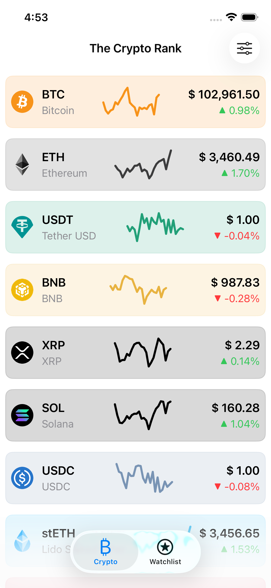
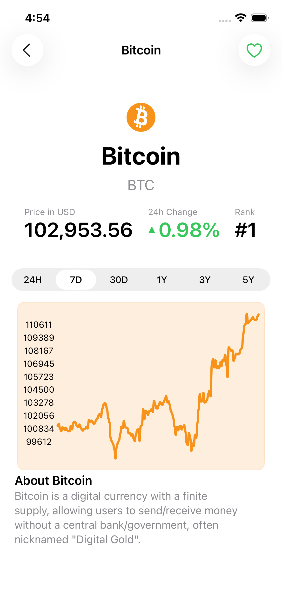
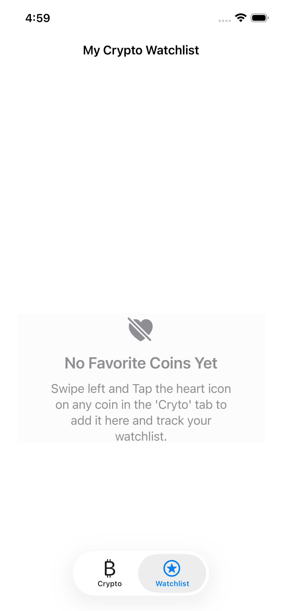
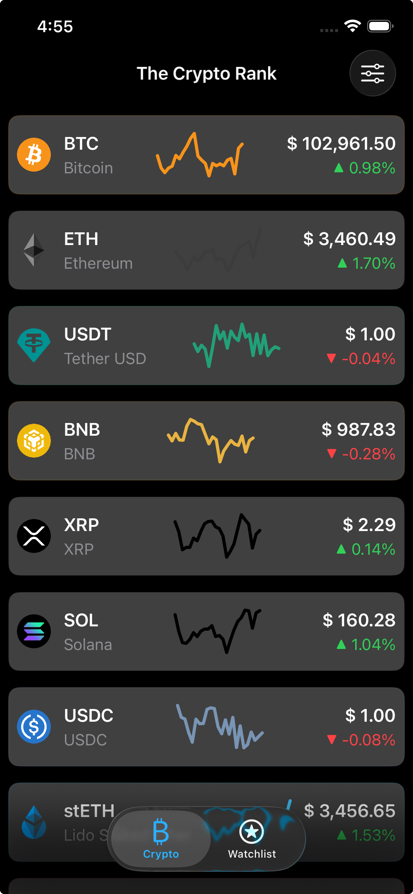
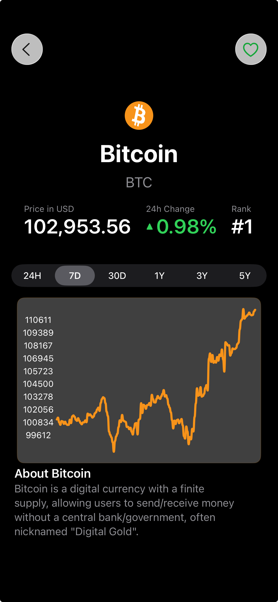
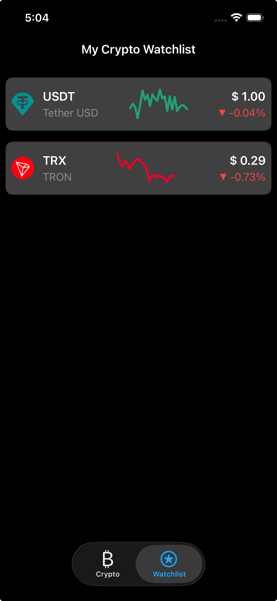

 
## 🪙 Crypto Ranker: Cryptocurrency Tracking App

[](https://swift.org)
[](http://cocoapods.org/pods/LFAlertController)


**Project Description:.**

Is an iOS application that fetches data from the [CointRanking API](https://developers.coinranking.com/api) and displays a list of the top 100
cryptocurrency coins paginated, showing 20 characters per page.

✨Application Features:
--------------
The application successfully implements a three-screen architecture using MVVM and UIKit/SwiftUI interoperability.

1.  **Coin List (Home Screen):**
    * Fetches and displays top 100 cryptocurrencies.
    * Pagination and filtering implemented.
    * UI: Uses a `UITableView` with embedded SwiftUI `CoinListRow` cards.
    * Visualization: Displays a sparkline chart (24H data) using `SwiftUICharts` library.
    * **Action:** Swipe-to-Favorite functionality.

2.  **Coin Details:**
    * Displays static data (price, rank) and historical chart data.
    * Uses a SwiftUI header for the main metrics.
    * Allows time period filtering (24H, 7D, 30D, 1Y).
    * Hides the tab bar for a focused view.
    
3.  **Favorites/Watchlist:**
    * Persists user-selected favorite coins using `UserDefaults`.
    * Synchronized across the entire app via `NotificationCenter`.
    * Displays a SwiftUI empty state message when the list is empty.


# [Screenshots 📱](Screenshots/)

|                         Home       (Light Theme)                         | Crypto Coin Details (Light Theme)                                          |                           Favourite  (Light Theme)                            |
|:------------------------------------------------------------------------:|----------------------------------------------------------------------------|:-----------------------------------------------------------------------------:|
|  |  |  |

|                               Home (Dark Theme)                               | Crypto Coin Details (DArk Theme)                                                |                        Favourite       (Light Theme)                         |
|:-----------------------------------------------------------------------------:|---------------------------------------------------------------------------------|:----------------------------------------------------------------------------:|
|  |  |  |

## 🏗️ Architecture & Technology Stack

* **Architecture:** **Model-View-ViewModel (MVVM)** with **Factory Pattern** for dependency injection (DI).
* **Networking:** Modern Swift Concurrency (`async/await`) for all API calls.
* **State Management:** **Combine** framework with `ObservableObject` and `@Published` properties for reactive data flow between ViewModels and Views.
* **UI:** Hybrid approach combining **UIKit** (`UIViewController`, `UITableView`) with embedded **SwiftUI** (`UIHostingController`) for custom cells and views.

## Tech-stack used 🛠
| **Tech Tools**                                           | **Usage/Purpose** |
|----------------------------------------------------------|-------------------|
| [Swift](https://www.swift.org/)                          | Language          |
| [UIKit](https://developer.apple.com/documentation/uikit) | IU                |
| [SwiftUI](https://developer.apple.com/swiftui/)          | UI                |


## 📦 Dependencies

The project uses Swift Package Manager (or CocoaPods) for the following third-party libraries:

| Library                                                                   | Purpose                                                                                          |
|:--------------------------------------------------------------------------|:-------------------------------------------------------------------------------------------------|
| [**SDWebImageSwiftUI**](https://github.com/SDWebImage/SDWebImageSwiftUI)  | Asynchronously loading and displaying images, including SVG icon support (`SDWebImageSVGCoder`). |
| [**SwiftUICharts (willdale)**](https://github.com/willdale/SwiftUICharts) | Robust and customizable line chart visualization for sparklines and historical data.             |

---
## Development Setup ⚙️ and Pre-requisite 📝
**The Project uses the free version of Coinranking API :**
1. [List of coins](https://coinranking.com/api/documentation/coins/coins) for list of coins.


#### _⚙️ Setup Coinranking API_

 <br/>
This project fetches weather data from the [coinranking.com](https://coinranking.com/api/documentation/coins/coins).  
To begin the setup, you'll need to create an account and get a free API key.
1. Create an account at [coinranking.com](https://account.coinranking.com/dashboard/api)
2. Go to API key & Usage
3. Your API key (you can create a new API or use the Auto-generated API key)

update or create the Config file  `AppConfig.xcconfig` and place your API config there 

```swift
#Insert at ~/ AppConfig.xcconfig

// Configuration settings file format documentation can be found at:
// https://help.apple.com/xcode/#/dev745c5c974
//
COIN_RANKING_API_KEY = <Your coinranking API Key>

````

## Build and Runtime Requirements
+ Xcode 15.0 or later
+ iOS v15.0 or later
+ macOS v10.10 or later

## ⚙️ Build and Run Instructions

1.  **Clone the Repository:** `git clone`  [Crypto-Ranker repository URL](https://github.com/AwesomeJim/Crypto-Ranker.git)
2.  **Install Dependencies:**  the project is using CocoaPods,so run `pod install`)
3.  **Open Project:** Open `CryptoCoinranking.xcworkspace`.
4.  **API Key:** Update the `API_KEY` setting in the **`AppConfig.xcconfig`** file with a valid CoinRanking API key.
5.  **Build Target:** Select the main application target and run on a modern iOS Simulator.

## 🧪 Testing and Quality Assurance

* **Unit Tests:** Coverage for `CoinListViewModel` and `NetworkService` logic using Mocks to verify state changes, error handling, and data transformation.
* **UI Tests:** Verification of the main user flow: application launch, list loading, and navigation to the detail screen.
* **Error Handling:** Implemented a centralized `AppError` model and Combine subscriptions in all View Controllers to show non-blocking error dialogs on network failure.


## 🚧 Challenges Encountered and Solutions

Building a robust application often involves overcoming specific technical hurdles. Below are the key challenges encountered and the solutions implemented, which demonstrate core technical proficiency.

### 1. 🖼️ Challenge: Displaying Remote SVG Icons
The CoinRanking API provides coin logos in a mix of both PGN and in the **SVG (Scalable Vector Graphics)** format.
* **Problem:** Native Apple frameworks (UIKit and SwiftUI) do not natively support rendering remote SVG files, leading to blank icons in the coin list view.
* **Solution:** Integrated the **SDWebImage** library along with its **`SDWebImageSVGCoder`** component. 
* The solution involved explicitly **registering the `SVGCoder`** during app startup (`SDImageCodersManager.shared.addCoder(...)`) and utilizing the `WebImage` view. This enables the app to automatically download, resize, and cache the vector icons.


License
--------

      Crypto-Ranker-Swift
      Copyright (c) 2025 Awesome Jim (https://github.com/AwesomeJim/Crypto-Ranker).

      Licensed under the Apache License, Version 2.0 (the "License");
      you may not use this file except in compliance with the License.
      You may obtain a copy of the License at

         http://www.apache.org/licenses/LICENSE-2.0

      Unless required by applicable law or agreed to in writing, software
      distributed under the License is distributed on an "AS IS" BASIS,
      WITHOUT WARRANTIES OR CONDITIONS OF ANY KIND, either express or implied.
      See the License for the specific language governing permissions and
      limitations under the License.
